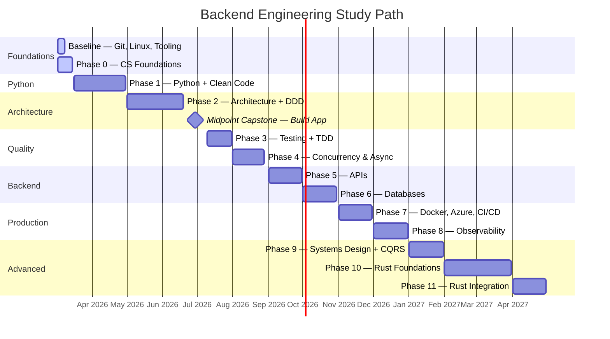

# 🗺️ Backend Engineering Study Path
## Tracker
> **Started:** March 2026 · **Current week:** W1

### 📊 Progress

|Phase|Focus|Timeline|Status|
|---|---|---|---|
|Baseline|Git, Linux, debugging, tooling|Mar 2026|🟡 In Progress|
|0|CS Foundations|Mar 2026 (2 weeks)|🟡 In Progress|
|1|Python mastery + Clean Code + SOLID|mid-Mar–Apr 2026|⬜ Upcoming|
|2|Professional architecture + DDD|May–Jun 2026|⬜ Upcoming|
|**Capstone**|**Build the to-do app**|Jun 2026|⬜ Upcoming|
|3|Testing + TDD + Refactoring|Jul 2026|⬜ Upcoming|
|4|Concurrency and async|Aug 2026|⬜ Upcoming|
|5|APIs and backend fundamentals|Sep 2026|⬜ Upcoming|
|6|Databases|Oct 2026|⬜ Upcoming|
|7|Production: Docker, Azure, CI/CD|Nov 2026|⬜ Upcoming|
|8|Observability|Dec 2026|⬜ Upcoming|
|9|Systems design + Microservices + CQRS/Events|Jan 2027|⬜ Upcoming|
|10|Rust foundations|Feb–Mar 2027|⬜ Upcoming|
|11|Rust integration / capstone|Apr 2027|⬜ Upcoming|

> ⬜ Upcoming · 🟡 In Progress · ✅ Complete

## 🧭 Context
- **Current level:** Junior Python developer
- **Target:** Senior backend engineer within 12 months
- **Time available:** Inconsistent — treat 45 min/day as the baseline target
- **Learning style:** Concept first, then apply via project
- **Anchor project:** Constraint-based to-do app (FastAPI + PostgreSQL + React)
- **Start date:** March 2026

## 💡 Guiding Principles
- Fundamentals before frameworks
- One tool per concern — avoid parallel learning of similar things
- Every concept should touch the project where possible
- AI writes boilerplate — you design systems
- Depth over breadth at every phase
- Tests are a design tool, not an afterthought
- Code katas are deliberate practice — use them to stress-test understanding

## ⚙️ Baseline: Git & Tooling
*Start immediately — not a phase, a prerequisite*

##### 🌿 Git
- Branching strategy (feature branches, main protection)
- Commit discipline — small, atomic, meaningful messages
- Rebase vs merge — know when to use each
- Pull requests as a communication tool, not just a merge mechanism

##### 🐧 Linux Basics
- Navigating the filesystem, file permissions, environment variables
- Common commands — grep, curl, ps, top, tail
- Understanding stdout/stderr and piping
- Everything you deploy runs on Linux — not knowing it will slow you down constantly

##### 🛠️ IDE & Debugging
- Debugger over print statements — learn to set breakpoints, inspect state, step through execution
- Know your editor shortcuts well enough that the tool disappears
- Ruff for formatting/linting from day one — non-negotiable

---

## 🎓 Phase 0 — CS Foundations
- **Timeline:** Weeks 1–2 (March 2026)
- **Resource:** CS50x

Work through the C weeks (memory, pointers) and algorithms sections. Skip the web tracks — they're not relevant to this path.

##### Why it matters
Removes "magic" from Python internals and prepares intuition for Rust later.

##### ✅ Exit Criteria
- You understand what a pointer is and why memory allocation matters
- You can trace through a basic sorting algorithm by hand

---

## 🐍 Phase 1 — Python Mastery + Clean Code
- **Timeline:** Months 1–2 (mid-March–April 2026)
- **Resources:** Fluent Python (Ramalho), Python docs on data model, Clean Code (Martin — Chapters 1, 2, 3, 6, 7, 10)

### Python Language
- Execution and data model
- Protocols and duck typing
- Generators and iterators
- Type hints and mypy
- Functions as first-class objects
- Composition over inheritance

### Clean Code & SOLID
- SOLID principles — understand each, then find violations in your own code
  - SRP, OCP, LSP, ISP, DIP
- Meaningful naming, small functions, clean error handling
- YAGNI — resist building what you don't need yet
- Tell, don't ask / Law of Demeter
- Watch: [Core Design Principles for Software Developers](https://www.youtube.com/watch?v=llGgO74uXMI)

### 🥋 Kata Practice
- [Racing Car Katas](https://github.com/emilybache/Racing-Car-Katas) — find and fix SOLID violations
- [String Calculator Kata](http://osherove.com/tdd-kata-1/) — simple, good for warming up
- [Bowling Game Kata](http://butunclebob.com/ArticleS.UncleBob.TheBowlingGameKata) — classic design exercise

##### ✅ Exit Criteria
- You can explain Python's execution model and what a dunder method does
- You can explain why composition beats inheritance
- You can identify a SOLID violation and correct it

---

## 🏛️ Phase 2 — Professional Architecture + DDD
- **Timeline:** Months 2–3 (May–June 2026)
- **Resources:** Architecture Patterns with Python (Percival & Gregory), Domain-Driven Design Quickly (InfoQ — free), Hexagonal/Clean Architecture essays

### Architecture & Patterns
- Project structure and layering
- Domain modelling
- Repository pattern
- Service layer pattern
- Dependency injection
- Error handling philosophy

### Clean Architecture Theory
Read in this order:
- [Hexagonal Architecture](https://web.archive.org/web/20090122225311/http://alistair.cockburn.us/Hexagonal+architecture) — Cockburn
- [The Onion Architecture](https://jeffreypalermo.com/2008/07/the-onion-architecture-part-1/) — Palermo
- [The Clean Architecture](https://blog.cleancoder.com/uncle-bob/2012/08/13/the-clean-architecture.html) — Martin
- Watch: [Clean Architecture and Design](https://www.youtube.com/watch?v=2dKZ-dWaCiU)

### Domain-Driven Design
- Ubiquitous language — name things the way the domain names them
- Entities vs value objects
- Aggregates and aggregate roots
- Repository pattern from a DDD lens
- Read: [Domain-Driven Design Quickly](https://www.infoq.com/minibooks/domain-driven-design-quickly) — Chapters 1–4
- Watch: [Tackling Complexity in the Heart of Software](https://www.youtube.com/watch?v=dnUFEg68ESM) — Eric Evans
- Read: [How to write a Repository](http://philcalcado.com/2010/12/23/how_to_write_a_repository.html)

### 🥋 Kata Practice
- [Social Networking Kata](https://github.com/sandromancuso/social_networking_kata) — build a clean architecture from scratch
- [Greeting Service Kata](https://github.com/joebew42/greeting-service-kata) — small, deployable, layered service

##### ✅ Exit Criteria
- Domain layer has zero FastAPI or SQLAlchemy imports
- You can explain the difference between an entity and a value object
- You can design a layered architecture on paper before writing a line of code

---

## 🏗️ Midpoint Capstone — Build the To-Do App
- **Timeline:** 2–3 weeks (June 2026)

This is where theory becomes product. You have enough — domain modelling, clean architecture, DDD vocabulary, Python fundamentals — to build something real. It won't be perfect. That's fine.

### What to Build
- Domain layer — Task entity, postpone constraint as a named domain concept, value objects where appropriate
- Service layer — orchestrates domain logic and persistence
- Basic PostgreSQL persistence — raw SQLAlchemy, no deep database knowledge yet
- FastAPI routes — just enough to expose the service layer over HTTP: create a task, fetch tasks, update deadline
- Basic request/response validation with Pydantic
- No auth yet, no migrations yet, no tests yet — those come later

### What This Builds Toward
Every phase from here improves this app:
- Testing adds confidence
- APIs harden the contract
- Databases make it production-safe
- Docker ships it

##### ✅ Exit Criteria
- The app runs locally
- You can create a task, attempt to postpone its deadline twice, and have the second attempt rejected by the domain layer — not the API, not the database
- The rule lives in the right place

---

## 🧪 Phase 3 — Testing + Refactoring
- **Timeline:** Month 3 (July 2026)
- **Resources:** Test-Driven Development with Python (Percival), Growing Object-Oriented Software Guided by Tests (Freeman & Pryce — selected chapters), Refactoring (Fowler — Chapters 1, 2, 3)

### Core Testing Concepts
- Unit vs integration vs functional vs end-to-end tests — know the distinctions and when each applies
- Testing at the right boundary
- Property-based testing with Hypothesis
- Designing for testability — if it's hard to test, the design is telling you something
- Mocks vs stubs — read [Mocks Aren't Stubs](http://martinfowler.com/articles/mocksArentStubs.html)
- Read: [Desirable properties of tests](https://medium.com/@kentbeck_7670/test-desiderata-94150638a4b3) — Kent Beck

### TDD as a Design Tool
Tests aren't just coverage — they drive design. Practice the red-green-refactor loop until it's instinct:
- Watch: [The deep synergy between testability and good design](https://www.youtube.com/watch?v=4cVZvoFGJTU)
- Watch: [TDD and Software Design](https://www.youtube.com/watch?v=ty3p5VDcoOI)
- Watch: [The Magic Tricks of Testing](https://www.youtube.com/watch?v=URSWYvyc42M) — Sandi Metz

### Refactoring Under Test
- Watch: [Workflows of Refactoring](https://www.youtube.com/watch?v=vqEg37e4Mkw)
- Exercise: [Gilded Rose Kata](https://github.com/joebew42/GildedRose) — add coverage first, then refactor
- Exercise: [Tennis Refactoring Kata](https://github.com/emilybache/Tennis-Refactoring-Kata)

### 🛒 To-Do App
- Retroactively add tests to the capstone app — domain layer unit tests first
- The postpone constraint should have exhaustive coverage
- Add service layer integration tests
- Add at least one functional test that exercises a full request path
- Write at least one test before implementing any new feature from this point forward

##### ✅ Exit Criteria
- Domain logic has full unit test coverage
- You can write a test before the implementation
- You can refactor a function without breaking its tests
- You can articulate the difference between a unit test and a functional test and choose the right one

---

## ⚡ Phase 4 — Concurrency and Async
- **Timeline:** Month 4 (August 2026)
- **Resources:** Python docs (asyncio), Fluent Python — concurrency chapters

### Topics
- The GIL — what it actually prevents
- Threads vs processes vs async
- Async event loop mechanics
- When to use each concurrency model
- Race conditions and how to avoid them

### 🛒 To-Do App
- FastAPI is async — understand what that means for your existing route handlers and DB calls
- Identify where concurrency creates risk: two simultaneous requests attempting to postpone the same task's deadline
- Understand why that's a problem before Phase 6 gives you the database tools to fix it properly

##### ✅ Exit Criteria
- You can explain why FastAPI uses async and what the event loop is doing during an awaited DB call
- You can explain when you'd reach for threads or processes instead
- You can identify the race condition in the postpone logic and explain why it exists

---

## 🌐 Phase 5 — APIs and Backend Fundamentals
- **Timeline:** Month 5 (September 2026)
- **Resources:** Designing Web APIs (Jin et al.), FastAPI docs, The Twelve-Factor App, MDN Web Docs (CORS, cookies)

### Topics
- REST principles and HTTP semantics — go deeper than the capstone required
- Authentication and authorisation (JWT, OAuth2 basics)
- Sessions vs JWT — understand the tradeoffs, not just the syntax
- Cookies — how they work, security attributes (HttpOnly, Secure, SameSite), when to use them over other storage
- CORS — what it protects against, how preflight requests work, how to configure it correctly in FastAPI
- API versioning strategies
- Idempotency
- Rate limiting and throttling — token bucket vs leaky bucket concepts
- Schema validation
- Error response design
- API pagination — cursor vs offset, and when each breaks down
- WebSockets — how they differ from HTTP, when real-time matters, FastAPI's native support
- Read: [The Twelve-Factor App](http://12factor.net/)

### 🛒 To-Do App
- Add auth — no unauthenticated user should be able to touch another user's tasks
- Configure CORS for the React frontend
- Add rate limiting to mutation endpoints
- Review every route for correct HTTP semantics and proper status codes
- Write an API design document before touching code

##### ✅ Exit Criteria
- Every route has correct status codes
- Auth is enforced server-side
- CORS is configured and you can explain why it's needed
- Rate limiting is in place
- You can explain the difference between authentication and authorisation without hesitation

---

## 🗄️ Phase 6 — Databases
- **Timeline:** Month 6 (October 2026)
- **Resources:** PostgreSQL docs, [Use The Index Luke](https://use-the-index-luke.com/) (free), SQLAlchemy docs, Alembic docs

### Migrations
- Alembic — versioned schema changes, upgrade and downgrade scripts
- Schema changes without migrations are a production liability
- Every schema change from this point forward goes through a migration

### Indexing
- How PostgreSQL uses indexes — B-tree, hash, when each applies
- EXPLAIN ANALYZE — read query plans, identify sequential scans, understand cost estimates
- Composite indexes and index selectivity
- Over-indexing and write overhead tradeoffs
- Read: [Use The Index, Luke](https://use-the-index-luke.com/) — Parts 1 and 2

### Transactions and Correctness
- ACID properties — what each guarantee means in practice
- Isolation levels — read uncommitted, read committed, repeatable read, serialisable
- Locking — row-level vs table-level, deadlocks and how to avoid them
- Optimistic vs pessimistic concurrency control
- Connection pooling basics

### Non-Relational Databases (Conceptual)
- Document stores, key-value stores, column-family databases — what each is optimised for
- CAP theorem — consistency, availability, partition tolerance
- When to reach for NoSQL vs SQL — and why "just use Postgres" is often the right answer
- Read: [NoSQL Distilled](https://martinfowler.com/books/nosql.html) — overview chapter (Fowler)

### 🛒 To-Do App
- Fix the race condition identified in Phase 4 — use serialisable isolation or row-level locking so two simultaneous postpone attempts on the same task are handled correctly
- Add Alembic migrations for every table
- Run EXPLAIN ANALYZE on your most common queries and add indexes where needed

##### ✅ Exit Criteria
- Schema changes are managed via Alembic
- You can read a query plan and explain what it means
- The postpone constraint is concurrency-safe at the database level
- You can explain the difference between repeatable read and serialisable isolation and when it matters

---

## 🚀 Phase 7 — Production: Docker, Azure, CI/CD
- **Timeline:** Month 7 (November 2026)
- **Resources:** Docker docs, AZ-204 Azure Developer course, GitHub Actions docs, Nginx docs

### Topics
- Docker and containerisation
- Environment configuration with pydantic-settings
- CI/CD pipeline design with GitHub Actions
- Secrets management — never in code
- Azure deployment — Container Apps or App Service
- Managed identity basics
- Nginx as a reverse proxy — what it does, why you put it in front of FastAPI, basic configuration

### 🛒 To-Do App
- Containerise the app
- Deploy to Azure with Nginx in front of FastAPI
- Build a pipeline that runs tests on every push and deploys on merge to main
- The pipeline is part of the codebase — treat it that way

##### ✅ Exit Criteria
- The app is live on Azure behind Nginx, deployed via CI/CD
- No secrets in code and tests gate every deployment
- You can explain what the reverse proxy is doing and why it's there

---

## 🔭 Phase 8 — Observability
- **Timeline:** Month 8 (December 2026)
- **Resources:** Distributed Systems Observability (Majors), OpenTelemetry docs

### Topics
- Structured logging — every log entry should be queryable
- Metrics — what to measure and why
- Distributed tracing — follow a request across service boundaries
- Alerting philosophy — alert on symptoms, not causes
- Debugging production failures from signals alone

### 🛒 To-Do App
- Add OpenTelemetry with structured logs on every request
- Trace a request from API through service layer to DB
- Ship logs to Azure Monitor
- Simulate a production failure — a postpone constraint being silently bypassed — and diagnose it using only logs and traces

##### ✅ Exit Criteria
- You can diagnose a simulated production failure using only observability signals — no print statements, no guessing

---

## 🏗️ Phase 9 — Systems Design + Microservices + Event-Driven Patterns
- **Timeline:** Month 9 (January 2027)
- **Resources:** Designing Data-Intensive Applications (Kleppmann — selective chapters), Building Microservices (Newman — selected chapters)

### Systems Design Fundamentals
Reading-heavy — goal is vocabulary and mental models, not full implementation:
- Data consistency models
- Replication basics
- Latency vs throughput tradeoffs
- Scaling patterns
- Failure modes

### Caching
- Cache-aside, read-through, write-through — know the difference
- Cache invalidation — why it's hard and how to think about it
- What belongs in a cache vs what doesn't
- Read-heavy task lists in the to-do app are a natural candidate

### Microservices
- Read: [Microservices](https://martinfowler.com/articles/microservices.html) — Fowler
- Read: Building Microservices (Newman) — Chapters 1, 2, 3, 4
- Watch: [Principles of Microservices](https://www.youtube.com/watch?v=PFQnNFe27kU)
- Read: [Microservice Trade-Offs](http://martinfowler.com/articles/microservice-trade-offs.html)
- Read: [Seven Microservices Anti-patterns](https://www.infoq.com/articles/seven-uservices-antipatterns) — know what goes wrong before you build one

### Background Jobs (Conceptual)
- Why you offload work from the request cycle — user-facing latency vs background processing
- Task queues — the concept behind Celery, RabbitMQ, Redis as a broker
- Deadline reminder notifications in the to-do app are a natural example

### CQRS and Event-Driven Architecture
Goal: reason about these in a design conversation, not implement them fully:
- Watch: [CQRS and Event Sourcing](https://www.youtube.com/watch?v=JHGkaShoyNs)
- Watch: [The Many Meanings of Event-Driven Architecture](https://www.youtube.com/watch?v=STKCRSUsyP0) — Fowler
- Read: [CQRS Journey](http://cqrsjourney.github.io/) — overview sections
- Exercise: [Bank Account Kata](https://github.com/sandromancuso/Bank-kata) — implement a basic CQRS/ES variant to make it concrete

### Data Structures & Algorithms
Targeted — not a full grind. Aimed at filling gaps that affect real backend decisions:
- Hash maps, trees, queues — when and why
- Big O intuition — not memorisation, understanding

##### ✅ Exit Criteria
- You can reason through a system design question by thinking through tradeoffs
- You can explain what CQRS separates and why someone would reach for event sourcing
- You can describe where caching and background jobs would improve the to-do app and why

---

## 🦀 Phase 10 — Rust Foundations
- **Timeline:** Months 10–11 (February–March 2027)
- **Resources:** The Rust Programming Language (the Book)

### Topics
- Ownership, borrowing, lifetimes
- Memory layout
- Error handling — Result, Option
- Structs and traits
- Zero-cost abstractions

### Project
Build a small standalone Rust CLI or simulation — not integrated into the to-do app yet. Something with enough interactivity to stay motivating.

Rust exposes what Python hides — the ownership model will change how you think about state everywhere.

### 🥋 Kata Practice
Revisit familiar katas in Rust to separate language learning from problem solving:
- [Bowling Game Kata](http://butunclebob.com/ArticleS.UncleBob.TheBowlingGameKata)
- [Roman Numerals Kata](http://www.codekatas.org/casts/roman-numerals-kata-with-audio-commentary)

##### ✅ Exit Criteria
- You understand why the borrow checker rejects a piece of code
- You can write a small working Rust program from scratch

---

## 🦀 Phase 11 — Rust Integration (Capstone)
- **Timeline:** Month 12 (April 2027)
- **Resources:** Project-driven

Extract the postpone constraint engine from the to-do app into a Rust microservice. Expose it via HTTP. Call it from FastAPI. This is where architecture, systems design, microservices thinking, and polyglot service design converge.

##### ✅ Exit Criteria
- Constraint rules run in Rust, called by Python, tested independently, deployed in the same CI/CD pipeline

---

## 💡 12+ Month Ideas
Intentionally out of scope — revisit once the core path is complete.

- **🎾 Tennis Training Intelligence System** — A backend-powered ML system acting as a digital tennis coach. Stores personal training and match sessions, detects weaknesses, predicts improvement trends, and generates personalised drill recommendations. Modules: weakness detection, improvement prediction, fatigue/overtraining detection, drill recommendation engine. Stack: FastAPI + PostgreSQL, scikit-learn / PyTorch, Docker + cloud deployment. Prerequisites: to-do app in production, solid domain/service layer architecture, comfortable with Docker and CI/CD
- **MongoDB hands-on** — build a small project properly; conceptual foundation is covered in Phase 9
- **Celery + Redis** — full background job implementation with task queues
- **Full CQRS/ES implementation** — build a proper event-sourced service end to end
- **Redis as a cache layer** — full implementation with invalidation patterns
- **Message brokers** — RabbitMQ or Kafka hands-on; complements Phase 9
- **Server/client-side rendering** — SSR concepts and Next.js, relevant once frontend becomes a focus
- **Kubernetes** — after Docker and Azure are solid
- **Django** — worth knowing for enterprise context, not during this path
- **Legacy code** — Working Effectively with Legacy Code (Feathers) — relevant once you're in a real codebase with inherited mess

---

## 🔧 Toolchain
| Concern | Tool |
|---|---|
| Language | Python 3.13+ |
| Linting / formatting | Ruff |
| Type checking | mypy |
| Testing | pytest + Hypothesis |
| Dependency management | Poetry |
| Web framework | FastAPI |
| Database | PostgreSQL |
| Migrations | Alembic |
| Observability | OpenTelemetry |
| Config | pydantic-settings |
| Containers | Docker |
| Reverse proxy | Nginx |
| CI | GitHub Actions |
| Cloud | Azure |
| IaC | Bicep |
| Systems language | Rust |

---

## 📅 Phase Summary
| Phase                 | Focus                                        | Timeline           |
| --------------------- | -------------------------------------------- | ------------------ |
| Baseline              | Git, Linux, debugging, tooling               | Immediate          |
| 0                     | CS Foundations                               | Mar 2026 (2 weeks) |
| 1                     | Python mastery + Clean Code + SOLID          | mid-Mar–Apr 2026   |
| 2                     | Professional architecture + DDD              | May–Jun 2026       |
| **Midpoint Capstone** | **Build the to-do app**                      | Jun 2026           |
| 3                     | Testing + TDD + Refactoring                  | Jul 2026           |
| 4                     | Concurrency and async                        | Aug 2026           |
| 5                     | APIs and backend fundamentals                | Sep 2026           |
| 6                     | Databases                                    | Oct 2026           |
| 7                     | Production: Docker, Azure, CI/CD             | Nov 2026           |
| 8                     | Observability                                | Dec 2026           |
| 9                     | Systems design + Microservices + CQRS/Events | Jan 2027           |
| 10                    | Rust foundations                             | Feb–Mar 2027       |
| 11                    | Rust integration / capstone                  | Apr 2027           |
